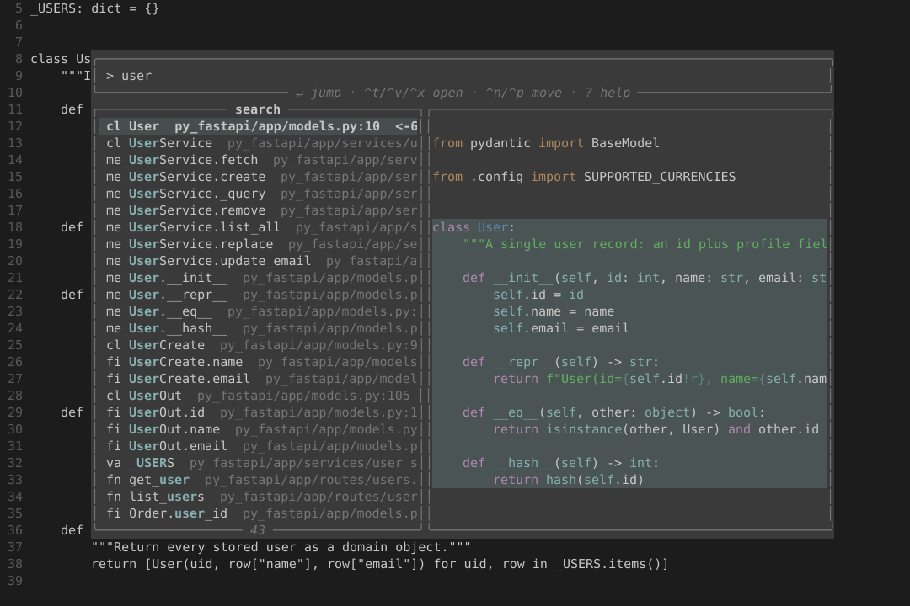
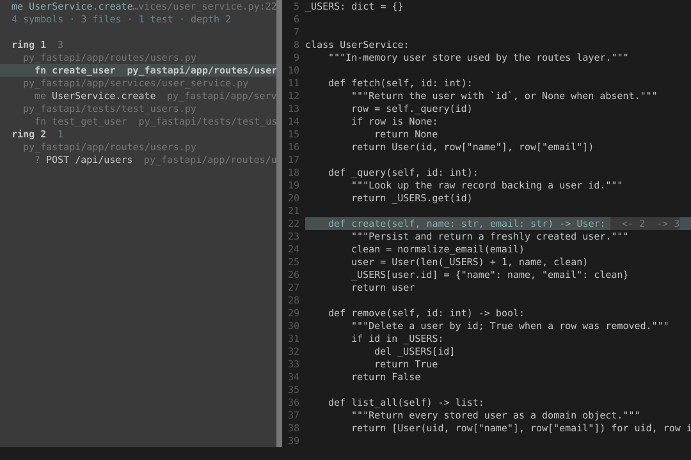
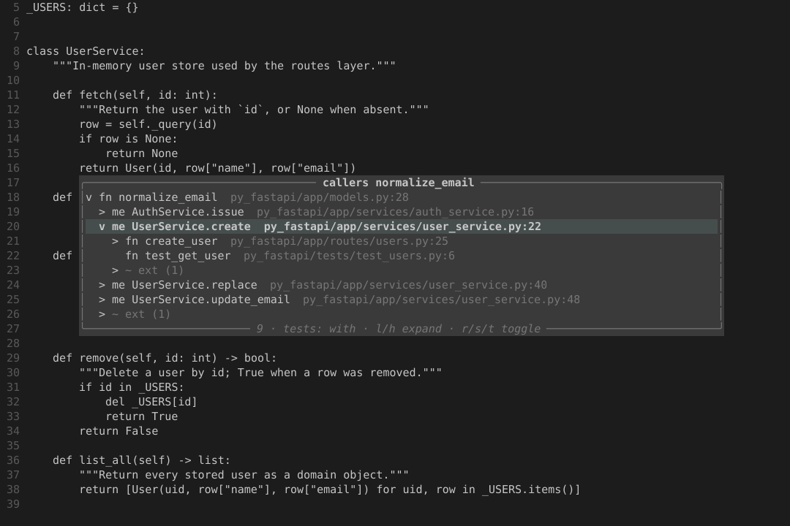
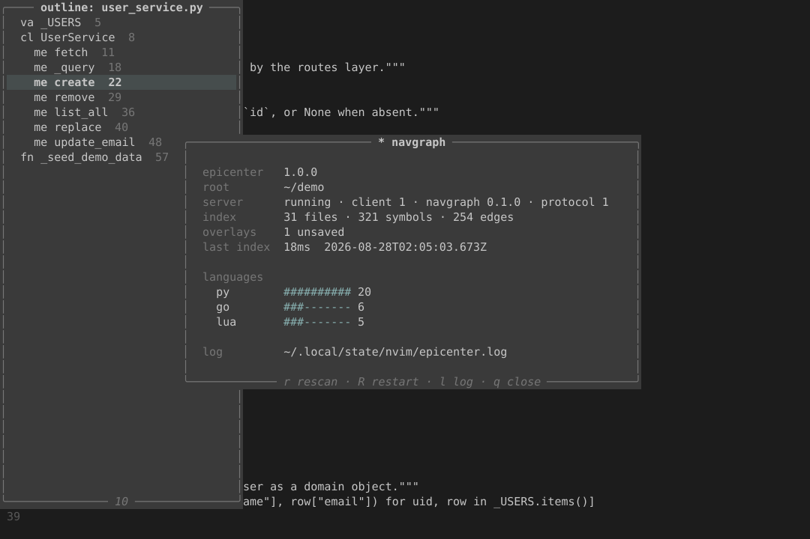

# epicenter.nvim

[](https://github.com/mengsig/epicenter.nvim/actions/workflows/ci.yml)

[](LICENSE)

Your code graph, live in the editor.

epicenter.nvim puts [NavGraph](https://github.com/mengsig/NavGraph) — a fast,
dependency-free code-graph engine — behind a Neovim UI. Ask what a symbol is,
who calls it, and what breaks if you change it, and get the answer while you
type. No daemon to babysit, no index to rebuild by hand, no language servers
required for the graph itself.

epicenter.nvim ships the **search palette** (fuzzy symbol search and repo-wide
grep) and **blast radius** (a live impact panel with ripples in the code, a
hover card of callers, fan-in/fan-out badges, and diff impact against a git
ref) — all live on every keystroke, all including your unsaved edits. On top
of it come the exploration panels: callers and callees as a tree that fetches
a level at a time, the call path between two symbols, a live outline sidebar,
fan-in hot spots, unused symbols, a graph export, and the status dashboard.



## Install

Needs Neovim 0.10+ and the `navgraph` binary (`:Epicenter install` fetches or
builds it for you). 0.11+ additionally gets an `lsp/navgraph.lua` definition,
so `vim.lsp.enable("navgraph")` works without this plugin's own start path.

**[lazy.nvim](https://github.com/folke/lazy.nvim)**

```lua
{
  "mengsig/epicenter.nvim",
  build = function()
    require("epicenter").install({ wait = true })
  end,
  opts = {},
}
```

**[packer.nvim](https://github.com/wbthomason/packer.nvim)**

```lua
use({
  "mengsig/epicenter.nvim",
  run = function()
    require("epicenter").install({ wait = true })
  end,
  config = function()
    require("epicenter").setup({})
  end,
})
```

**built-in `vim.pack`** (Neovim 0.12+)

```lua
vim.pack.add({ "https://github.com/mengsig/epicenter.nvim" })
require("epicenter").setup({})
```

Then `:Epicenter install` once, and `:checkhealth epicenter` to confirm.

Calling `setup()` is optional — the defaults apply on their own. Call it to
change them.

## The panels

Every mock below is this plugin's own output against `tests/fixtures/real` with
`ui.icons = "ascii"`, trimmed to fit the page. With a nerd font the two-letter
kind tags (`fn`, `me`, `cl`, `va`) are glyphs instead.

### Search palette — `:Epicenter search`, `<leader>es`

Fuzzy search over every definition in the project. Type and the list narrows on
each keystroke; the preview follows the selection. The trailing number is
fan-in — how many places reach that symbol.

```
╭─ search ───────────────────────────────╮ ╭─ py_fastapi/app/models.py ──────╮
│ > user                                 │ │ class User:                     │
╰────────────────────────────────────────╯ │     """A single user record."""  │
╭────────────────────────────────────────╮ │                                 │
│ cl User            models.py:10    <-6  │ │     def __init__(self, id: int,│
│ cl UserService     user_service.py:8 <-8│ │         self.id = id            │
│ me UserService.fetch  ...py:11     <-3  │ │         self.name = name        │
│ me UserService.create ...py:22     <-2  │ │         self.email = email      │
│ va _USERS          user_service.py:5 <-6│ │                                 │
│ fn get_user        routes/users.py:18<-1│ │     def __repr__(self) -> str:  │
╰────────────────────────────────────────╯ ╰─────────────────────────────────╯
```

In search only, `<C-k>` cycles the kind filter. `<C-r>` flips to reference mode
(where a hit is a use rather than a definition), and `<C-y>` yanks `file:line`.

### Grep — `:Epicenter grep`, `<leader>eg`

The same widget over raw text instead of symbol names, across the whole repo,
including the edits you have not saved.

```
╭─ grep ─────────────────────────────────────────────────────────────────────╮
│ > normalize_email                                                          │
╰────────────────────────────────────────────────────────────────────────────╯
╭────────────────────────────────────────────────────────────────────────────╮
│  py_fastapi/app/services/auth_service.py:6   from app.models import norma… │
│  py_fastapi/app/services/auth_service.py:18  who = normalize_email(email)  │
│  py_fastapi/app/services/user_service.py:24  clean = normalize_email(email)│
│  py_fastapi/app/services/user_service.py:44  clean = normalize_email(email)│
│  py_fastapi/app/models.py:28                 def normalize_email(email: st…│
╰────────────────────────────────────────────────────────────────────────────╯
```

`<C-r>` switches the query to a regex.

### Blast radius — `:Epicenter blast`, `<leader>ee`

What breaks if you change this. The panel is a live query: it stays open, and
it re-runs as you edit. `+`/`-` change the depth, `d` flips callers ↔ callees,
`t` cycles the test scope, `s` drops the heuristic edges.

```
╭─ blast ────────────────────────────────────────────────────────────────────╮
│  fn create_user  py_fastapi/app/routes/users.py:25                         │
│  2 symbols · 1 file · 0 tests · depth 1        <- callers · tests with      │
│                                                                            │
│  ring 1  2                                                                 │
│    py_fastapi/app/routes/users.py                                          │
│      ? POST /api/users  py_fastapi/app/routes/users.py:24                  │
│      fn create_user     py_fastapi/app/routes/users.py:25                  │
╰────────────────────────────────────────────────────────────────────────────╯
```

While it is open, the impacted lines are marked in the source windows —
three shades by ring distance. A `?` in front of a row means the edge was
resolved by name, not by a certain reference; `s` hides those.

`:Epicenter diff [ref]` is the same panel with every symbol changed since a git
ref as its roots.

### Hover card — `:Epicenter hover`, `<leader>ek` (or `K`)

The signature, the counts, the doc comment, and who calls it — without leaving
the line. It does not take focus; press the key again to step in, then `<CR>`
to jump.

```
╭────────────────────────────────────────────────────────────╮
│  me UserService.create                                     │
│  def create(self, name: str, email: str) -> User:          │
│                                                            │
│  <- 2 callers   -> 3 callees    user_service.py:22-27      │
│                                                            │
│  Persist and return a freshly created user.                │
│                                                            │
│  top callers                                               │
│    fn create_user   py_fastapi/app/routes/users.py:25      │
│    fn test_get_user py_fastapi/tests/test_users.py:6       │
╰────────────────────────────────────────────────────────────╯
```

### Callers and callees — `:Epicenter callers` / `callees`, `<leader>ec` / `<leader>eC`

A tree that fetches one level at a time: `l` expands the row under the cursor
and asks the server only for that level, `h` collapses it.

```
╭─ callers of create_user ───────────────────────────────────────────────────╮
│ v fn create_user      py_fastapi/app/routes/users.py:25                    │
│     ? POST /api/users py_fastapi/app/routes/users.py:24                    │
╰────────────────────────────────────────────────────────────────────────────╯
```

### Peek — `:Epicenter peek`, `<leader>eP`

The definition under the cursor in a float that does **not** take focus. `<CR>`
goes there, `q` dismisses it, and so does moving the cursor. Both keys are
borrowed from the buffer underneath and handed straight back.

```
╭─ py_fastapi/app/models.py:28 ──────────────────────────────────────────────╮
│ def normalize_email(raw: str) -> str:                                      │
│     return raw.strip().lower()                                             │
╰──────────────────────── <CR> go · q dismiss ───────────────────────────────╯
```

The same component answers `o` inside every panel — there it takes focus,
because the panel already holds the cursor.

### Call path — `:Epicenter path`, `<leader>ep`

The chain between two symbols, drawn one rung at a time.

```
╭─ path ─────────────────────────────────────────────────────────────────────╮
│                                                                            │
│  fn create_user        py_fastapi/app/routes/users.py:25                   │
│  │                                                                         │
│  v                                                                         │
│  me UserService.create py_fastapi/app/services/user_service.py:22          │
│  │                                                                         │
│  v                                                                         │
│  fn normalize_email    py_fastapi/app/models.py:28                         │
│                                                                            │
╰────────────────────────────────────────────────────────────────────────────╯
```

When there is no path it says so, rather than showing an empty panel.

### Outline — `:Epicenter outline`, `<leader>eo`

A real vertical split down the left edge, live: it follows the cursor and
re-renders when the buffer is reindexed. `<C-k>` cycles the outline's kind
filter. `<CR>` jumps and hands the cursor back to the code, leaving the sidebar
open — a sidebar you keep browsing from must never sit on top of the definition
it just took you to, so this one takes its own columns instead of covering
them. `outline.layout = "float"` gets a transient overlay instead, which closes
on the jump for the same reason.

```
 outline: user_service.py                              10 · functions
  va _USERS            5 │ class UserService:
  cl UserService       8 │     def fetch(self, user_id: int):
    me fetch          11 │         return self._query(user_id)
    me _query         18 │
    me create         22 │     def _query(self, user_id: int):
    me remove         29 │         return _USERS.get(user_id)
    me list_all       36 │
    me replace        40 │     def create(self, name: str, email: str):
    me update_email   48 │         user_id = len(_USERS) + 1
  fn _seed_demo_data  57 │         _USERS[user_id] = {"name": name}
```

### Hot spots — `:Epicenter hot`, `<leader>eh`

What the rest of the code leans on, ranked by fan-in, with a bar scaled to the
widest one. `b` toggles between this buffer and the whole repo.

```
╭─ hot ──────────────────────────────────────────────────────────────────────╮
│ me UserService.fetch        user_service.py:11  ############ 3             │
│ me UserService.create       user_service.py:22  ########---- 2             │
│ me UserService._query       user_service.py:18  ########---- 2             │
│ me UserService.replace      user_service.py:40  ####-------- 1             │
│ me UserService.update_email user_service.py:48  ####-------- 1             │
│ fn _seed_demo_data          user_service.py:57  ------------ 0             │
╰────────────────────────────────────────────────────────────────────────────╯
```

### Unused — `:Epicenter unused`

Definitions nothing in the index reaches. `p` hides the exported ones, which
are the usual false positives for a library.

```
╭─ unused ───────────────────────────────────────────────────────────────────╮
│ me Status.String    go_service/models/models.go:66                         │
│ fn normalizeName    go_service/models/models.go:79                         │
│ st LegacyWidget     go_service/models/models.go:88                         │
│ fn NewClient        go_service/client/client.go:20                         │
│ cl LegacyToken      py_fastapi/app/models.py:123                           │
│ me Vec.lensq        lua_game/vec.lua:20                                    │
╰────────────────────────────────────────────────────────────────────────────╯
```

### Status dashboard — `:Epicenter status`, `<leader>ex`, or bare `:Epicenter`

What the server knows, and the three keys that change it: `r` rescan,
`R` restart, `l` open the log.

```
╭─ · navgraph ───────────────────────────────────────────────────╮
│                                                                │
│  epicenter   1.0.1                                             │
│  root        ~/src/myproject                                   │
│  server      running · client 1 · navgraph 1.0.0 · protocol 1  │
│  index       32 files · 330 symbols · 258 edges                │
│  overlays    1 open                                            │
│  last index  1ms  2026-08-28T01:52:44Z                         │
│                                                                │
│  languages                                                     │
│    py        ########## 20                                     │
│    go        ###------- 6                                      │
│    lua       ###------- 5                                      │
│    zig       #--------- 1                                      │
│                                                                │
│  log         ~/.local/state/nvim/epicenter.log                 │
│                                                                │
╰────────────────── r rescan · R restart · l log · q close ──────╯
```

### Graph — `:Epicenter graph`

Writes the call graph to an HTML file under the project's `.navgraph/` and
opens it.

### Badges

Not a panel: `badges` puts a definition's fan-in and fan-out at the end of its
line as virtual text — `"cursor"` for the one you are inside (the default),
`"all"` for every definition in the buffer, `false` for none.

```
    def create(self, name: str, email: str) -> User:      <- 2  -> 3
```

### In colour

The same surfaces out of a real 120x36 terminal, regenerated by
`make screenshots` — a real Neovim driving the real panels against a real
`navgraph lsp`, captured from a tmux pane and converted by
`scripts/ansi2svg.lua`.

**Blast radius**, panel left, ripples and badges in the code on the right:



**Callers**, two levels deep:



**Outline sidebar and the status dashboard**, together:



## Keymaps

One prefix, `<leader>e` by default (`keymaps = false` installs none).

<!-- registry:keymaps -->
| Key          | Command              | Does                                       |
| ------------ | -------------------- | ------------------------------------------ |
| `<leader>es` | `:Epicenter search`  | Fuzzy symbol search across the project     |
| `<leader>eg` | `:Epicenter grep`    | Repo-wide text search, unsaved edits too   |
| `<leader>ee` | `:Epicenter blast`   | Blast radius of the symbol at the cursor   |
| `<leader>ek` | `:Epicenter hover`   | What this symbol is, and who calls it      |
| `<leader>ed` | `:Epicenter diff`    | Impact of the changes since a git ref      |
| `<leader>ec` | `:Epicenter callers` | Who calls the symbol under the cursor      |
| `<leader>eC` | `:Epicenter callees` | What the symbol under the cursor calls     |
| `<leader>eP` | `:Epicenter peek`    | Read the definition under the cursor       |
| `<leader>ep` | `:Epicenter path`    | Call chain between two symbols             |
| `<leader>eo` | `:Epicenter outline` | Live symbol outline of the current buffer  |
| `<leader>eh` | `:Epicenter hot`     | Most depended-on symbols, ranked by fan-in |
| `<leader>ex` | `:Epicenter status`  | Dashboard: index, server, languages, log   |
<!-- /registry:keymaps -->

Inside the palette:

| Key                | Does                                          |
| ------------------ | --------------------------------------------- |
| `<CR>`             | Jump to the result (pushes the jumplist)      |
| `<C-t>`/`<C-v>`/`<C-x>` | Open in a tab / vertical split / split   |
| `<C-n>`/`<C-p>`    | Next / previous result                        |
| `<C-r>`            | Toggle reference mode (grep: regex)           |
| `<C-k>`            | Cycle the kind filter (search only)           |
| `<C-y>`            | Yank `file:line`                              |
| `?` / `j` / `k`    | Key help / move (normal mode)                 |
| `<Esc>`            | Normal mode, then close (like everywhere else in Neovim) |
| `q`                | Close (normal mode)                           |

## Commands

`:Epicenter <subcommand>`, with completion.

<!-- registry:commands -->
| Subcommand | Does                                       |
| ---------- | ------------------------------------------ |
| `search`   | Fuzzy symbol search across the project     |
| `grep`     | Repo-wide text search, unsaved edits too   |
| `blast`    | Blast radius of the symbol at the cursor   |
| `hover`    | What this symbol is, and who calls it      |
| `diff`     | Impact of the changes since a git ref      |
| `callers`  | Who calls the symbol under the cursor      |
| `callees`  | What the symbol under the cursor calls     |
| `peek`     | Read the definition under the cursor       |
| `path`     | Call chain between two symbols             |
| `outline`  | Live symbol outline of the current buffer  |
| `hot`      | Most depended-on symbols, ranked by fan-in |
| `unused`   | Symbols nothing in the index reaches       |
| `graph`    | Write the call graph to a file and open it |
| `status`   | Dashboard: index, server, languages, log   |
| `install`  | Download or build the navgraph binary      |
| `restart`  | Restart the server for this project        |
| `rescan`   | Re-stat every file and rebuild the index   |
| `log`      | Open the epicenter log                     |
<!-- /registry:commands -->

Every subcommand ships today; none are pending.

### To the quickfix list

Every subcommand that produces rows takes `--qf` or `--loc`, sending the result
set to the quickfix list (or this window's location list) instead of leaving it
in a panel — the list opens ready for `:cnext`.

```vim
:Epicenter blast --qf
:Epicenter callers M.handle --loc
```

Inside any panel or palette, `<C-q>` and `<C-l>` do the same thing. `<Tab>`
toggles a row into a multi-selection first: with a selection `<C-q>` sends only
those rows, with none it sends every row on screen. Each entry carries `file`,
`line`, `col` and the row's own text.

### Inside the blast panel

| Key            | Does                                                     |
| -------------- | -------------------------------------------------------- |
| `<CR>`         | Jump to the symbol (panel stays open - it's a live query)|
| `<C-v>` / `<C-t>` | Open in a vertical split / a new tab                  |
| `o`            | Toggle a peek at it without leaving the panel             |
| `y`            | Yank `file:line`                                         |
| `<Tab>`        | Add / remove the row from the selection                  |
| `<C-q>` / `<C-l>` | Send the rows to the quickfix / location list         |
| `+` / `-`      | Deeper / shallower (re-queries; the chip names the depth asked for when the graph fell short) |
| `d`            | Flip callers ↔ callees                                   |
| `t`            | Cycle the tests scope (with → without → only)            |
| `s`            | Toggle strict resolution (drops heuristic edges)         |
| `f`            | Follow the cursor                                        |
| `j`/`k`/`gg`/`G` | Move                                                   |
| `/`            | Filter by name                                            |
| `?`            | Toggle the key help                                      |
| `q` / `<Esc>`  | Close                                                    |

On a buffer where navgraph is the hover provider — which under
`lsp.fallback_only` means no other language server offers one — `K` opens the
hover card too.

### Inside the callers/callees tree

(and every other results panel - outline, hot, unused - which share the same
`j`/`k`/`gg`/`G`/`<CR>`/`o`/`y`/`<Tab>`/`<C-q>`/`/`/`?`/`q` keys)

| Key                     | Does                                           |
| ----------------------- | ----------------------------------------------- |
| `j` / `k` / `gg` / `G`  | Move                                           |
| `l` / `h`               | Expand (fetching that level) / collapse        |
| `<CR>`                  | Jump to the symbol                             |
| `<C-v>` / `<C-t>`       | Open in a vertical split / a new tab           |
| `o`                     | Peek at the definition without leaving the panel |
| `y`                     | Yank `file:line`                               |
| `<Tab>`                 | Add / remove the row from the selection        |
| `<C-q>` / `<C-l>`       | Send the rows to the quickfix / location list  |
| `r`                     | Toggle reference edges                         |
| `s`                     | Strict mode - drop the `?` (heuristic) edges   |
| `t`                     | Cycle the test scope: with / without / only    |
| `<C-k>`                 | Outline: cycle the kind filter                 |
| `b`                     | Hot: buffer / repo scope                       |
| `p`                     | Unused: hide the public symbols                |
| `/`                     | Filter by name                                 |
| `?`                     | Toggle the key help (normal mode)              |
| `q` / `<Esc>`           | Close                                          |

## Configuration

Defaults in full:

<!-- registry:config -->
```lua
require("epicenter").setup({
  animate = true,                           -- master switch; vim.g.epicenter_reduce_motion wins
  animation = {
    close_ms = 90,
    fps = 60,
    frame_budget_ms = 8,                    -- a frame costing more than this drops the next one
    open_ms = 120,
    stagger_ms = 8,
  },
  badges = "cursor",                        -- "cursor" | "all" | false
  blast = {
    depth = 2,                              -- rings requested
    direction = "callers",                  -- "callers" | "callees"
    follow_debounce_ms = 80,
    layout = "float",                       -- "float" | "vsplit"
    max_depth = 6,                          -- upper bound for `+` in the panel
    realtime_debounce_ms = 150,
    strict = false,                         -- drop name-resolved (heuristic) edges
    tests = "with",                         -- "with" | "without" | "only"
  },
  explore = { debounce_ms = 100 },          -- quiet time after a reindex before rows refetch
  grep = { debounce_ms = 60, limit = 200 },
  highlights = {},                          -- e.g. { EpicenterAccent = { fg = "#7aa2f7" } }
  hot = { bar_width = 12, limit = 30 },
  hover = { callers = 5, max_width = 80 },
  keymaps = { prefix = "<leader>e" },       -- or false, to install none
  log = { file = nil, level = "warn" },     -- file defaults to stdpath("state")/epicenter.log
  lsp = {
    auto_start = true,
    fallback_only = true,                   -- yield definition/references/hover to another server
    init_options = {                        -- passed verbatim as LSP initializationOptions
      debounceMs = 120,
      depth = 3,
      strict = false,
      tests = "with",                       -- "with" | "without" | "only"
      watch = true,
      watchIntervalMs = 2000,
    },
    restart = { backoff_ms = { 500, 2000, 5000 }, max = 3 },
    root_markers = { ".navgraph", ".git" }, -- checked in order at each level, walking upward
  },
  navgraph = {
    args = {},                              -- extra arguments appended to `navgraph lsp`
    install_ref = nil,                      -- git ref to build from, on the source route
    path = nil,                             -- explicit path; else $PATH, then the managed install
    repo = "mengsig/NavGraph",              -- source for :Epicenter install
  },
  outline = { debounce_ms = 80, layout = "vsplit", width = 34 },
  path = { step_ms = 45 },                  -- time each rung of the path ladder takes to draw
  ripples = true,                           -- mark the impacted lines while a panel is open
  search = { debounce_ms = 40, limit = 50 },
  ui = {
    border = "rounded",
    height = 0.8,                           -- fraction of the editor when <= 1, else cells
    icons = "auto",                         -- "auto" | "nerd" | "ascii"
    max_height = 30,
    max_width = 120,
    preview = true,
    width = 0.8,                            -- fraction of the editor when <= 1, else cells
    winblend = 0,
  },
  unused = { limit = 200 },
})
```
<!-- /registry:config -->

Unknown keys and wrong types are errors at `setup()` time, naming the exact
option — a typo never silently does nothing.

### Colours

Highlight groups are derived at runtime from your colourscheme (`Normal`,
`NormalFloat`, `FloatBorder`, `Comment`, `Title`, `Function`, `Special`,
`DiagnosticInfo`) and re-derived on `ColorScheme`. One accent, monochrome text
hierarchy. Every group is overridable through `highlights`:
`EpicenterNormal`, `EpicenterBorder`, `EpicenterTitle`, `EpicenterAccent`,
`EpicenterMatch`, `EpicenterMuted`, `EpicenterCount`, `EpicenterInfo`,
`EpicenterSelection`, `EpicenterPrompt`, `EpicenterHint`, `EpicenterRange`.

The blast panel adds `EpicenterRipple1`, `EpicenterRipple2` and
`EpicenterRipple3` — the ring grades of the inline marks, derived from the
accent over the *editor* background rather than the float background.

## How it relates to NavGraph

NavGraph is the engine: a single static Zig binary that lexes and indexes a
repo, extracts definitions and their in-body references, and resolves a call
graph across files and languages. Its CLI answers the same questions from a
terminal.

epicenter.nvim runs `navgraph lsp`, which speaks LSP over stdio — the standard
subset (`definition`, `references`, `hover`, `documentSymbol`,
`workspace/symbol`) plus custom `navgraph/*` methods for the graph queries.
One server per workspace root. Your open buffers are sent as overlays, so
answers include edits you have not saved yet. Match highlight indices in
`navgraph/search` are 0-based byte offsets into the symbol's qualified name.

With `lsp.fallback_only` (the default), navgraph's standard providers are
hidden on buffers that already have a real language server, so `gd`, `gr` and
`K` never return duplicates — and still work in the many files no language
server covers.

## Why it feels instant

Every server call is asynchronous and cancellable, and each keystroke's
request is tagged: when a newer query is issued, an older answer - however
it arrives, even synchronously - is dropped rather than painted, so results
never flicker backwards to a query you have already replaced. Requests are
debounced (40ms for search) so a fast typist issues a handful of queries,
not one per character.

The one blocking read on the UI path is the preview's file slice, capped at
20,000 lines scanned and 400 lines shown - past that it says so instead of
freezing. `:checkhealth`'s binary version check blocks too (a user-invoked
report, `:wait(3000)` at worst).

Motion is cheap and interruptible: one `vim.uv` timer per animation, geometry
interpolated over 120ms, and a frame that costs more than 8ms drops the next
one instead of queueing behind it. A resize reflows in place — it never
animates. `animate = false` or `vim.g.epicenter_reduce_motion = true` turns all
of it off, and every widget lands on exactly the same final state.

## Extending

Adding a feature is one new file plus one line.

1. Write `lua/epicenter/features/<name>.lua` returning a feature spec:

   ```lua
   local M = {}
   M.name = "blast"
   M.summary = "Blast radius of the symbol under the cursor"
   M.options = { blast = { depth = 3 } }   -- merged into the config defaults
   M.commands = {
     { name = "blast", desc = "Blast radius", run = function(ctx) end },
   }
   M.keymaps = { { suffix = "b", command = "blast", desc = "Epicenter: blast" } }
   return M
   ```

2. Add one `require` line to `lua/epicenter/features/init.lua`.

A feature validates its own options with `option_rules` (`variants` for the
types a path accepts, `enums` for its values, `positive` for numbers that must
be > 0), and can watch the session with `setup = function(cfg) ... end`, which
runs at the end of `setup()` and must be idempotent.

`lua/epicenter/registry.lua` collects the specs, and `plugin/epicenter.lua`,
`:Epicenter` completion, the keymap installer, `:checkhealth` and the config
defaults all iterate it — nothing else needs editing. Two features claiming the
same subcommand or option key is a hard error, never a silent override.

Feature modules must not `require("epicenter.config")` at file scope: config
builds its defaults from the registry, so that would be a cycle. Require it
inside `run`.

The UI kit is the public contract for features:
`ui/window`, `ui/animate`, `ui/easing`, `ui/theme`, `ui/icons`, `ui/list`,
`ui/tree`, `ui/prompt`, `ui/preview`, `ui/toast`, `ui/palette`, `ui/panel`.
`ui/palette` is the prompt+list+preview widget; `ui/panel` is the float that
carries a list or a tree plus the shared jump/peek/yank keys.
Server access goes through `epicenter.client`, which already has a helper for
every `navgraph/*` method.

## FAQ

**I already run a language server for this file. Do I get two of everything?**

No. With `lsp.fallback_only` (the default) navgraph hides its `definition`,
`references`, `hover` and `documentSymbol` providers on any buffer where
another server offers them, so `gd`, `gr` and `K` keep going to your real
language server. The graph queries — every `:Epicenter` panel — are unaffected;
they never go through the standard LSP methods. In the many files no language
server covers, navgraph's providers are still there. Set
`lsp = { fallback_only = false }` if you want it to answer everywhere.

**How does `:Epicenter install` get the `navgraph` binary?**

Both `epicenter.nvim` and [NavGraph](https://github.com/mengsig/NavGraph) are
public repos, so either route works with no GitHub access of your own. When
`gh` is installed *and* authenticated (`gh auth status` exits 0), the
installer runs `gh release download` against `navgraph.repo` — a prebuilt
binary in a few seconds. Otherwise it falls back to `git clone` + `zig build`,
which needs `git` and `zig` on `$PATH` and takes roughly a minute. `gh` only
buys speed here, not access — skip it and the fallback still works.
`:checkhealth epicenter` tells you which route is available. Point
`navgraph.repo` at your fork, and `navgraph.install_ref` at a branch or tag,
to build something other than the default `main`.

**I do not use a nerd font and the icons are boxes.**

Set `ui = { icons = "ascii" }` for the two-letter kind tags and `<-`/`->`
arrows. The default is `"auto"`, which picks glyphs only when
`vim.g.have_nerd_font` is set — so boxes mean something else set that flag.
`:checkhealth epicenter` reports which mode is live.

**Animations. I do not want them.**

`vim.g.epicenter_reduce_motion = true` turns off every tween globally and wins
over any config; `animate = false` in `setup()` does the same for this plugin's
own config. Nothing is skipped — every widget lands on exactly the same final
state, immediately. Individual timings live under `animation` if you only want
them faster.

**What actually differs between Neovim 0.10 and 0.11+?**

Everything the plugin does works on both; 0.10 is the floor. Two things are
0.11+ only, and neither is required:

- `vim.lsp.enable("navgraph")`. On 0.11+ the repo ships `lsp/navgraph.lua`, so
  you can start the server through Neovim's own mechanism instead of this
  plugin's. On 0.10 the plugin's `vim.lsp.start` path is the only route — which
  is also the default on 0.11+, so most users never touch this.
- `'winborder'`. It does not exist on 0.10; on 0.11+ it is ignored here, since
  every epicenter float names its own border (`ui.border`).

`:checkhealth epicenter` names your version and which of the two you have.

**Where do errors go?**

`:Epicenter log` (or `l` on the status dashboard). Every error toast names the
file, and `log = { level = "debug" }` turns up the detail.

## Development

```sh
make test        # headless suite, against the fake server
make test-real   # the same features against a real `navgraph lsp` binary
make smoke       # drives the real palette in a real Neovim and asserts the result
make lint        # stylua --check + luacheck
make fmt         # stylua
make docs-check  # README/vimdoc still match the registry
make docs-fix    # regenerate them
make screenshots # regenerate assets/*.svg (needs tmux and a navgraph binary)
```

Tests run against `tests/fake_navgraph.lua`, a fake server that speaks the same
protocol over stdio against `tests/fixtures/proj` — so the suite needs no `zig`
and no network. Its handlers are registered per area under `tests/fake/`; a new
area is one new file there.

`make test-real` runs `tests/real/` against the real binary over
`tests/fixtures/real`, a small multi-language tree. Set `NAVGRAPH_BIN` when the
`navgraph` on `$PATH` is not the one you mean to test. Both lanes enforce
`tests/contract/schema.lua`, the editor protocol as data: a request carrying a
param the contract does not name is refused, and a response missing a promised
field fails.

`make screenshots` runs a real Neovim inside a 120x36 tmux pane, drives each
surface against a real `navgraph lsp` over a throwaway copy of
`tests/fixtures/real`, captures the pane with `tmux capture-pane -e` and
converts the SGR grid to SVG with `scripts/ansi2svg.lua`. It uses its own tmux
socket and its own `$HOME`, so it cannot touch a session you already have open
and the paths in the committed assets are nobody's in particular.

The keymap table, the command table and the config reference above are
**generated** from `lua/epicenter/registry.lua` — the regions between the
`<!-- registry:… -->` markers here and the `*epicenter-…-table*` tags in
`doc/epicenter.txt` are written by `make docs-fix`, and CI fails if they drift.
Edit the feature spec, not the table.

## Changelog

[CHANGELOG.md](CHANGELOG.md).

## Licence

MIT © Marcus Engsig
